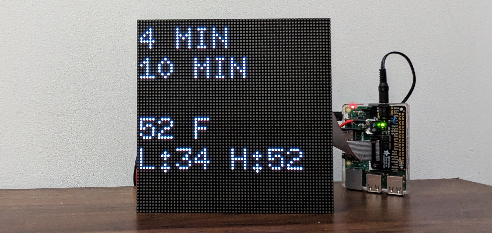

A hobby project to display the duration until the next 2 southbound A trains arrive at the 181st station and the weather.

When leaving for the train in the morning I want to know how many minutes it will take for the next A train to arrive. These scripts query from the NYC MTA's APIs how many minutes the next two trains will come.

Additionally, the screen displays the current temperature outside, the high and low temperatures over the next 12 hours, and if is going to rain or snow. This information is cached to not query the weather APIs too frequently.

There's still work to be done on this project, but the program runs on startup on a Raspberry Pi, so in case of issues, the Pi can just be restarted. One problematic case that is not covered is when WiFi goes down, the screen eventually goes blank and that is not handled gracefully right now.

Crontab on RaspberryPi looks like this: 
```
@reboot sleep 120 &&  /home/aryeh/dev/trains-clone/env_pi/bin/python /home/aryeh/dev/trains-clone/screen_example.py --led-rows=64 --led-cols=64 --led-slowdown-gpio=5 --led-no-hardware-pulse 1 --led-brightness=40 > /home/aryeh/dev/trains-clone/output.txt 2>&1 &
```

Previous commits have my application keys for the MTA and weather APIs that I'm still using. Please don't use them. If you end up cloning this repo, please get other keys. If it turns out someone else is using my keys, I'll have to generate a new key for myself anyways, at which point you will need a new key. So please, get your own API keys.

I have not written test cases for this code.
Here is an image of the setup running.
